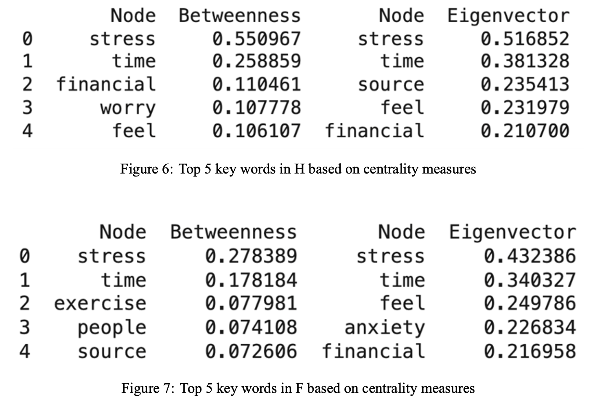

# (Complex Network and NLP 05/2024) A Network-Analysis-Based Approach on Extracting Main Idea and Internal Word Relations of Applicational Texts

## Network Construction
**Nodes** refer to words cleaned after data processing.
**Edges** are added between the two nodes that represent the two words if two words are in neighboring positions.
The network has **1459 nodes and 3521 edges**, indicating the number of potential keywords and connections.

### Undirected Graph (Filtered Based on Degree)
Select **nodes with a degree (number of connections) of 40 or greater** and add them to a subnetwork. For each neighbor of these selected nodes, if **the neighbor also has a degree of 20 or greater**, then the edge between these two nodes is added to the subnetwork. This process helps focus the analysis on highly connected parts of the network and can be used to identify key structures or clusters within the network.

This graph contains **37 nodes and 74 edges**.

### Undirected Graph (Filtered Based on Frequency)
Selects nodes based on their frequency in the original text. Any word that appears at least **10 times** is selected, because the fact that they are constantly stressed suggests their significance. 

This graph contains **37 nodes and 109 edges**.

## Hypothesis
* H1: Document Community - Each community represents a specific article or document.
* H2: Thematic Word Community - Each community contains vocabulary centered around specific themes (such as ”actions”, ”reason”, etc.).
* H3: Part of Speech Community - Each community corresponds to a part of speech (such as nouns or verbs).

## Result and Conclusion

  

  

  

  

